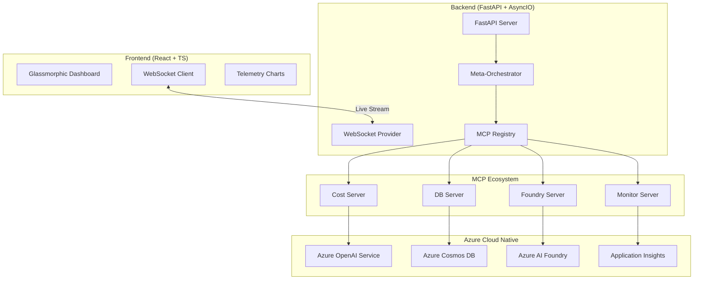

# APEX Platform: Advanced AI Meta-Orchestration Command Center

<div align="center">
  
  <br>
  <em>Futuristic Command Center for multi-agent governance and real-time observability.</em>
</div>

## 🌌 Overview
APEX (**Automated Provisioning & Execution**) is a state-of-the-art **multi-agent control plane** and real-time observability Command Center. It is designed to modernize enterprise AI governance by solving the dual challenges of **unpredictable latency** and **unscaled cloud costs**.

APEX provides the *intelligent layer that manages and optimizes* Microsoft AI services in production, ensuring cost-efficiency, reliability, and deep observability across complex agentic workflows.

---

## 🏗️ Technical Architecture

APEX follows a robust micro-service inspired architecture with real-time bidirectional telemetry powered by WebSockets and OpenTelemetry.



---

## 🔌 Model Context Protocol (MCP) Ecosystem

APEX utilizes a modular MCP-based architecture for tool discovery and execution. This allows agents to interact with disparate services through a standardized interface.

- **Foundry Server**: Bridges communication with Azure AI Foundry for model management and security scrubbing.
- **Azure Monitor Server**: Exposes real-time performance metrics and log data to agents for self-healing logic.
- **Cost Management Server**: Provides agents with real-time billing data, allowing for cost-aware decision making.
- **Database Server**: Standardized CRUD operations for persistent agent memory via Cosmos DB.
- **Alert Server**: Integrated Slack/Webhook notifications for critical system events.
- **MCP Registry**: A central hub that manages tool registration, enabling dynamic capability discovery for the Orchestrator.

---

## ☁️ Azure Cloud Native Integration

APEX is built to leverage the full power of the Microsoft Azure ecosystem:

- **Azure Cosmos DB**: Acts as the "Longe-Term Memory" (LTM) for the agent fleet, storing session states, vector embeddings, and persistent context.
- **Azure AI Foundry**: Provides the infrastructure for model experimentation, dynamic routing between LLMs (like GPT-4o) and SLMs (like Phi-3), and PII scrubbing for data privacy.
- **Azure Monitor & App Insights**: Deep instrumentation via OpenTelemetry (OTel) provides sub-second visibility into API latency, token consumption, and system health.
- **Microsoft Semantic Kernel**: Orchestrates the interaction between agents and plugins, ensuring consistent execution patterns.

---

## 🤖 The Meta-Orchestrator Agent Fleet

| Agent | Responsibility | Key Tech |
| :--- | :--- | :--- |
| **ORCHESTRATOR** | Goal decomposition and high-level strategy. | Semantic Kernel Orchestration |
| **COST_ROUTER** | Dynamic model switching based on ROI metrics. | Azure AI Foundry Routing |
| **QUERY_INTEL** | Semantic parsing and intent classification. | OTel-instrumented parsing |
| **PRODUCTION_READY**| Automated risk scoring and latency guardrails. | Azure Monitor Feedback Loop |

---

## 🧪 Detailed Features

### 1. Live Performance Telemetry

The dashboard features dynamic, panning Recharts visualizations that track actual millisecond data from live Azure OpenAI calls and cumulative cost savings.

### 2. Deep-Dive Observability (Thought Streams)

By clicking any agent, users view the pop-up **Agent Detail Modal**. This features a live **Thought Stream**—a scrolling terminal showing raw, sub-second logs of API calls and internal decision-making.

---

## 🛠️ Setup & Installation

### Environment Configuration
Create a `.env` file in the root directory:
```env
AZURE_OPENAI_ENDPOINT=https://your-resource.services.ai.azure.com/
AZURE_OPENAI_API_KEY=your_key
COSMOS_DB_ENDPOINT=https://your-cosmos.documents.azure.com:443/
COSMOS_DB_KEY=your_cosmos_key
SLACK_WEBHOOK_URL=https://hooks.slack.com/services/...
```

### Execution Flow

**Backend (Python)**
```bash
uvicorn api.main:app --port 8000 --reload
```

**Frontend (React)**
```bash
cd frontend && npm start
```

---

## 📄 License
MIT License. Built with ❤️ for Advanced AI Orchestration.

