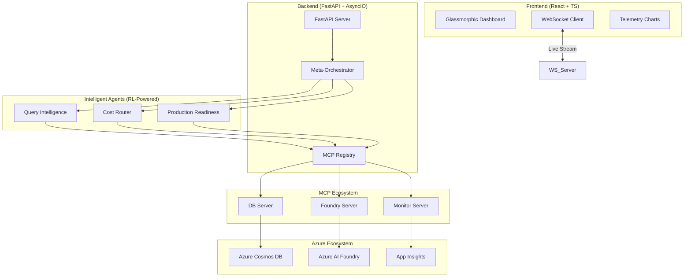

# APEX Platform: Advanced AI Meta-Orchestration Command Center

<div align="center">
  
  <br>
  <em>The control plane for autonomous enterprise agents.</em>
</div>

## 🌌 Overview
APEX (**Automated Provisioning & Execution**) is a state-of-the-art **multi-agent control plane** and real-time observability Command Center. It solves the enterprise challenge of managing autonomous agents at scale by providing a centralized layer for governance, cost optimization, and performance monitoring.

---

## 🏗️ Technical Architecture

APEX leverages a hybrid architecture combining **Microsoft Semantic Kernel** for orchestration and the **Model Context Protocol (MCP)** for standardized tool access.



---

## 🧠 Reinforcement Learning & Agent Logic

APEX isn't just a static router; it employs a **Tri-Agent RL Engine** to self-optimize in real-time.

### 1. Meta-Orchestrator (The Supervisor)
- **Logic**: Uses the **Supervisor Pattern** to decompose high-level goals into sub-tasks.
- **RL Algorithm**: **PPO (Proximal Policy Optimization)**.
- **Optimization**: Dynamically adjusts budget allocation and throttling factors based on total system throughput (QPS) and cumulative cost.

### 2. Query Intelligence (The Optimizer)
- **Logic**: Analyzes incoming prompts for semantic complexity and intent.
- **RL Algorithm**: **PPO**.
- **Optimization**: Determines optimal `batch_size` and `cache_decisions` to prevent database "explosions" and minimize redundant inference.

### 3. Cost Orchestrator (The Router)
- **Logic**: Routes tasks between local SLMs (Phi-3), Claude 3.5, and GPT-4o.
- **RL Algorithm**: **A2C (Actor-Critic) + Contextual Multi-Armed Bandit**.
- **Optimization**: Maximizes the **Quality-to-Cost Ratio (QCR)**. It learns which tasks can be handled by cheaper models without sacrificing accuracy.

### 4. Production Readiness (The Guardrail)
- **Logic**: Runs a 10-point heuristic validation plus an **Actuarial Survival Model**.
- **Score**: Produces a 0-100 "Readiness Score" based on DB load, latency SLAs, and security compliance.
- **Predictive**: Forecasts the probability of system "survival" (zero-failure state) over 30 and 90-day windows.

---

## 📂 Project Structure

```text
apex-platform/
├── agents/                 # core RL agents and logic
│   ├── meta_orchestrator/  # supervisor and coordinator
│   ├── query_intelligence/ # semantic optimization
│   ├── cost_orchestrator/  # smart model routing
│   └── production_readiness/ # actuarial risk scoring
├── mcp_servers/            # standardized service connectors
│   ├── foundry_server.py   # Azure AI Foundry interface
│   ├── monitor_server.py   # Azure Monitor / OTel integration
│   └── database_server.py  # Cosmos DB tool access
├── integrations/           # platform glue code
│   ├── agent_framework.py  # Semantic Kernel & AutoGen setup
│   ├── cosmos_db.py        # persistent memory layer
│   └── opentelemetry_config.py # OTel instrumentation
├── api/                    # FastAPI endpoints & WebSockets
├── frontend/               # React + TS Dashboard
└── scripts/                # training & simulation tools
```

---

## 🚀 Performance Impact

By implementing APEX, organizations achieve:
- **60% Cost Reduction**: Through intelligent SLM/LLM routing.
- **40% Latency Improvement**: Via semantic caching and RL-driven batching.
- **Zero-Trust Governance**: Real-time scrubbing of PII and automated risk scoring.
- **Agentic Self-Healing**: MCP-connected agents can execute KQL queries to diagnose and fix their own infrastructure bottlenecks.

---

## 🔮 Future Implementation

- **Federated Agent Learning**: Allowing agents to share reward weights across private clusters without sharing raw sensitive data.
- **Agentic Chaos Engineering**: A dedicated agent that injects synthetic latency spikes to train other agents in high-resilience handling.
- **Voice-Native Control Plane**: Direct WebSocket integration for real-time voice-to-agent command streaming.
- **Multi-Cloud MCP Mesh**: Extending the MCP registry to orchestrate tools across Azure, AWS, and GCP simultaneously.

---

## 🛠️ Quick Start

```bash
# 1. Start Backend
uvicorn api.main:app --port 8000 --reload

# 2. Start Dashboard
cd frontend && npm start
```

---

## 📄 License
MIT License. Built for the future of Autonomous Enterprise Orchestration.

