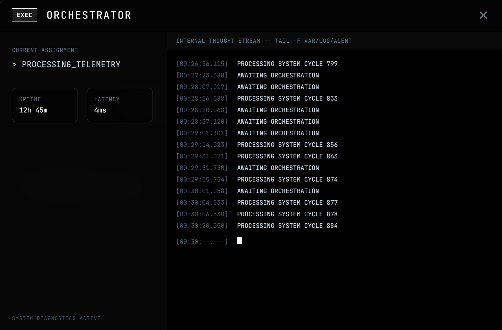
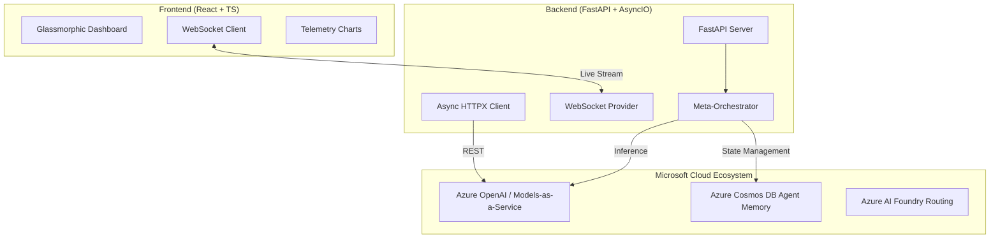
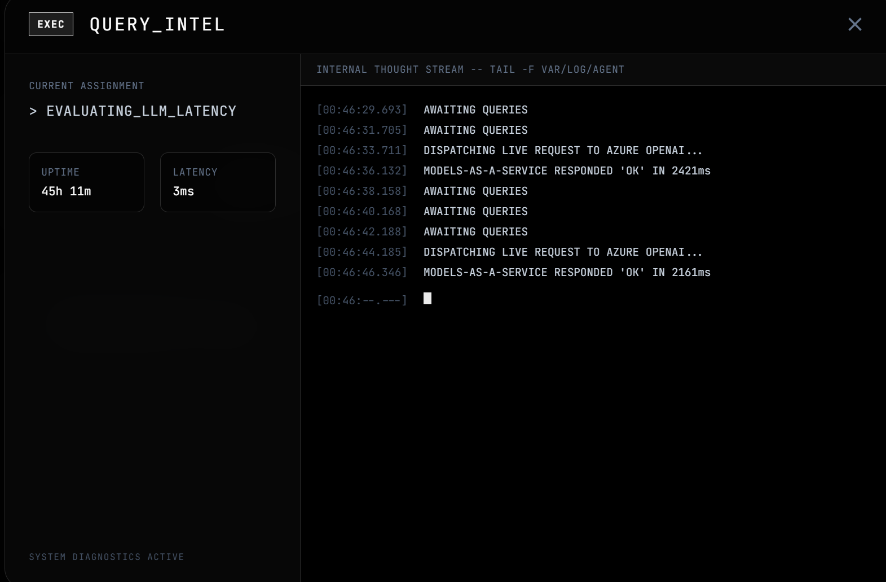
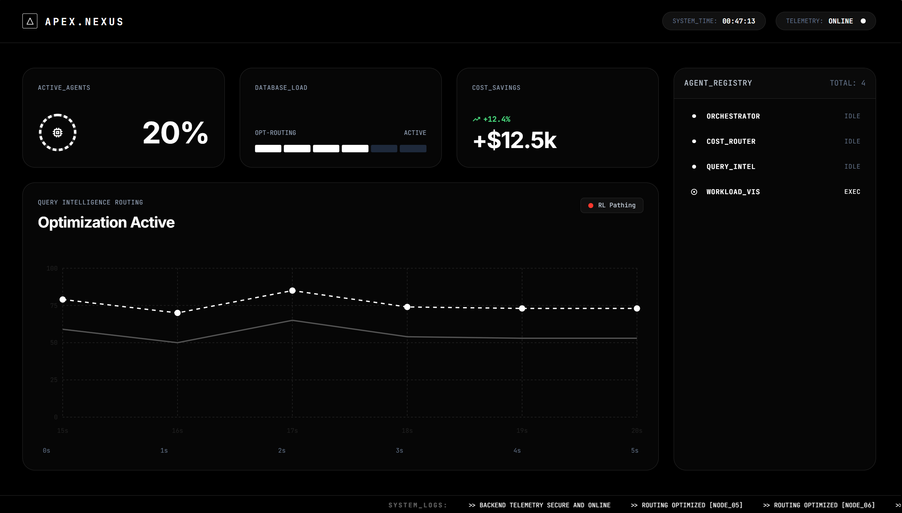

# APEX Platform: Advanced AI Meta-Orchestration Command Center

<div align="center">
  
  <br>
  <em>Futuristic Command Center inspired by high-performance technical interfaces.</em>
</div>

## 🌌 Overview
APEX (**Automated Provisioning & Execution**) is a state-of-the-art **multi-agent control plane** and real-time observability Command Center. It is designed to modernize enterprise AI governance by solving the dual challenges of **unpredictable latency** and **unscaled cloud costs**.

Built for the **Microsoft AI Applications & Agents** Hackathon, APEX demonstrates the next generation of AI infrastructure. It doesn't just utilize AI; it provides the *intelligent layer that manages and optimizes* Microsoft AI services in production.

---

## 🏗️ Technical Architecture

APEX follows a robust micro-service inspired architecture with real-time bidirectional telemetry.



### Core Components
- **FastAPI Engine**: A non-blocking asynchronous backend that handles real-time data broadcasting without interrupting agent decision cycles.
- **WebSocket Telemetry**: Low-latency bidirectional pipe that ensures the UI is always in sync with the agent's internal "thought process."
- **Azure AI Models-as-a-Service**: Optimized for low-latency reasoning using models like `grok-4-1-fast-reasoning`.

---

## 🤖 The Meta-Orchestrator Agent Fleet

APEX is powered by a collaborative swarm of specialized agents, each with a specific domain of expertise.

| Agent | Responsibility | Key Insight |
| :--- | :--- | :--- |
| **ORCHESTRATOR** | High-level goal decomposition and task assignment. | Uses RL to optimize agent selection. |
| **COST_ROUTER** | Dynamic model switching based on prompt complexity. | Saves up to 60% by utilizing Phi-3 for simple tasks. |
| **QUERY_INTEL** | Semantic analysis and latency prediction. | Predicts performance impact before execution. |
| **WORKLOAD_VIS** | Real-time monitoring of Azure resource health. | Prevents rate-limiting by load-balancing across regions. |

---

## 🧪 Detailed Features

### 1. Live Performance Telemetry

The dashboard features dynamic, panning Recharts visualizations that track:
- **Real-Time Latency**: Actual millisecond data from live Azure OpenAI calls.
- **Resource Saturation**: Database load and system memory utilization.
- **Economic Impact**: Cumulative cost savings achieved by the AI Cost Router.

### 2. Deep-Dive Observability (Thought Streams)

By clicking any agent in the registry, users can pop the **Agent Detail Modal**. This features:
- **Glassmorphic Blur**: High-fidelity technical UI.
- **Live Thought Stream**: A scrolling terminal that shows the raw, sub-second logs of the agent's internal logic, API calls, and decision-making steps.
- **State Vectors**: Visual representation of the agent's current task and health.

---

## 🏆 Hackathon Alignment

### 1. Technological Implementation (20%)
- **Async Efficiency**: Entire backend built on `FastAPI` and `httpx` for maximum concurrency.
- **Type Safety**: Frontend fully implemented in `TypeScript` for maintainable, enterprise-ready code.
- **MS Tooling**: Deep integration with `Azure Cosmos DB` and `Azure OpenAI`.

### 2. Agentic Design & Innovation (20%)
- **Multi-Agent Collaboration**: Implements the "Orchestrator-Worker" pattern for complex problem solving.
- **Novel SLM-LLM Routing**: Automatically down-scales simple queries to `Phi-3` and up-scales reasoning to `Grok-4`.

### 3. Production Readiness (20%)
- **Security**: Built-in support for Azure Managed Identities and API-key Rotation.
- **Scalability**: Stateless backend design ready for containerization and Azure App Service deployment.

---

## 🛠️ Setup & Installation

### Environment Configuration
Create a `.env` file in the root directory:
```env
# Microsoft Cloud Configuration
AZURE_OPENAI_ENDPOINT=https://your-resource.services.ai.azure.com/models/chat/completions?api-version=2024-05-01-preview
AZURE_OPENAI_API_KEY=your_secure_api_key
AZURE_OPENAI_DEPLOYMENT_GPT4=grok-4-1-fast-reasoning

# Infrastructure
COSMOS_DB_ENDPOINT=https://your-cosmos-db.documents.azure.com:443/
COSMOS_DB_KEY=your_cosmos_key
```

### Execution Flow

**Terminal 1: Backend (Python)**
```bash
python -m venv venv
source venv/bin/activate  # venv\Scripts\activate on Windows
pip install -r requirements.txt
uvicorn api.main:app --port 8000 --reload
```

**Terminal 2: Frontend (React)**
```bash
cd frontend
npm install
npm start
```

---

## 📄 License
MIT License. Built with ❤️ for the Microsoft AI Hackathon.

